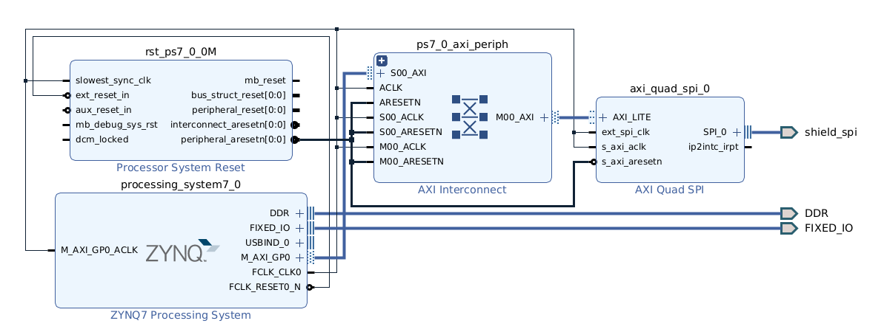

# AXI SPI Controller using Zynq

&nbsp;

# Vivado Block Design Diagram

&nbsp;

* Change value of `FCLK_CLK0` on Zynq processor to set the frequency of SCK signal on SPI hardware.

* 8-bit transmit width